# Cooking recipes assistant - `Smachna` 
## A few words about the project
### What?
`Smachna` is a tool, that helps me save, organize, and simplify recipes. 
From websites, TikTok, Instagram, and more, turning them into organized, clean, easy-to-follow steps.
I decided to make `Smachna` for my own purpose to use personally. 

### Why?
Always I face issues, while having multiple sources of receipts, like
- pinned websites with cool receipts, 
- or saved tikok videos,
- or instagram posts/videos
- many more... 

And it's a headache to find out where I saved my receipts! 

Additionally, content makers make videos shorter, making me pause the video or screenshot ingridents.
Or cooking websites have lots of content, completely or partially unrelated related to the core - receipt.

With all of these headaches I decided to make & **share** this API (app).
is a cozy and intuitive mobile recipe app designed to simplify cooking. It allows users to search, save, and transform recipes into a clean, structured format. Powered by modern technologies like Python, Swift, and the latest LLM APIs, RecipeEase delivers a seamless experience for food enthusiasts.  

## Features  
- 🥗 **Structured Recipes**: All recipes have a consistent format with ingredients, steps, and dish information (calories, cooking time, etc.).  
- 🌐 **Website Parsing**: Share a recipe link, and the app converts it into a clean, usable recipe.  
- 🎥 **Future Vision**: Support for parsing TikTok, YouTube, and Instagram videos into step-by-step recipes.  
- 📚 **User Recipe Library**: Save and organize your favorite recipes with tags and categories.  

```mermaid
flowchart TD
    %% Start Flow
    Start["Start"] --> Onboarding["Onboarding"]
    Onboarding --> SignIn["Sign In"]
    Onboarding --> SignUp["Sign Up"]
    Onboarding --> Error["Error"]

    %% Authentication Flow
    SignIn --> SocialMedia["Social Media Login"]
    SignIn --> EmailLogin["Email Login"]
    SignUp --> SocialMediaSignup["Social Media Sign-Up"]
    SignUp --> EmailSignup["Email Sign-Up"]
    Error --> Onboarding

    %% Home Flow
    Onboarding --> Home["Home"]
    Home --> SearchBox["Search Box"]
    Home --> Filter["Filter"]
    Filter --> CookTime["Cook Time"]
    Filter --> Difficulty["Difficulty"]
    Filter --> DishType["Dish Type"]
    Filter --> Suggested["Suggested Recipes"]

    %% Search Flow
    Home --> Search["Search"]
    Search --> Recipes["Recipes"]
    Search --> Chefs["Chefs"]
    Search --> Tags["Tags"]

    %% Recipes Flow
    Recipes --> CookTime
    Recipes --> Difficulty
    Recipes --> DishType
    Recipes --> Suggested

    %% Add New Flow
    Home --> AddNew["Add New"]
    AddNew --> ChooseFile["Choose File or Take Shots"]
    AddNew --> EditCrop["Edit and Crop"]
    AddNew --> WriteCaption["Write Caption"]
    AddNew --> AddInfo["Add Recipe Information"]
    AddInfo --> Ingredients["Add Ingredients"]
    AddInfo --> Introduction["Add Introduction"]
    AddNew --> NewCollection["Make New Collection"]
    AddNew --> CurrentCollection["Add to Current Collection"]

    %% Save Flow
    AddNew --> Save["Save"]
    Save --> NewCollection
    Save --> CurrentCollection
    Save --> EditCollection["Edit Collection"]

    %% Profile Flow
    Save --> Profile["Profile"]
    Profile --> AddPicture["Add Profile Picture"]
    Profile --> AddCover["Add Profile Cover"]
    Profile --> EditInfo["Edit Profile Info"]
    Profile --> Share["Share Profile"]
```

## Tech Stack  
- **Backend**: Python 3.12 API.  
- **Mobile**: Swift for iOS-native development with smooth animations and lightweight performance.  
- **Cloud**: Best practices in modern cloud architecture (to be shared as development progresses).  

## Roadmap  
Project Plan Recap
1. Design Recipe Structure ✅ 
   - Completed with the Recipe Pydantic model.
2. Simple First MVP of the Backend ✅ 
   - A Python script (via prompt_manager) parses a website into the recipe structure.
3. Add Feature to Extract content from TikTok Videos ⏳
   - Not yet implemented. Requires investigation into TikTok’s API or other methods.
4. Add User Recipe Database ⏳ 
   - The current implementation doesn’t yet save parsed recipes. Database integration is needed.
5. Script for Background Recipe Generation ⏳
   - Not yet implemented. Will likely involve LLM calls or web scraping pipelines.
6. Design Mobile App ❌
   - Not started. No UI/UX design or mobile app setup yet.
7. Develop Demo Mobile App ❌
   - Not started. Requires backend completion and mobile framework selection.
8. Adjust Mobile App (TBD) ❌
   - Future step, pending mobile app completion.

## Contribute  
RecipeEase is an open-source project! Contributions, feature suggestions, and feedback are welcome.  

## Recipe structure
```json
{
  "title": "Spaghetti Carbonara",
  "ingredients": [
    {"name": "Spaghetti", "quantity": 200, "unit": "g"},
    {"name": "Eggs", "quantity": 2, "unit": "pcs"},
    {"name": "Parmesan cheese", "quantity": 50, "unit": "g"},
    {"name": "Bacon", "quantity": 100, "unit": "g"},
    {"name": "Black pepper", "quantity": 1, "unit": "tsp"}
  ],
  "steps": [
    "Boil spaghetti until al dente.",
    "Cook bacon in a pan until crispy.",
    "Beat eggs with grated Parmesan cheese in a bowl.",
    "Drain spaghetti and mix with the bacon.",
    "Remove from heat and mix in the egg and cheese mixture.",
    "Season with black pepper and serve immediately."
  ],
  "dish_info": {
    "calories": 450,
    "prep_time": 10,
    "cook_time": 20
  },
  "tags": ["Italian", "quick", "classic"]
}
```

## Heroku helpers
`git push heroku main` - deploy from local 

`heroku logs --tail -a cooking-assistant-api` - check the app logs

## License
This project is licensed under the Educational Community License v2.0 (ECL-2.0).  
**Note:** This code is provided strictly for educational purposes. Any commercial use is strongly discouraged.